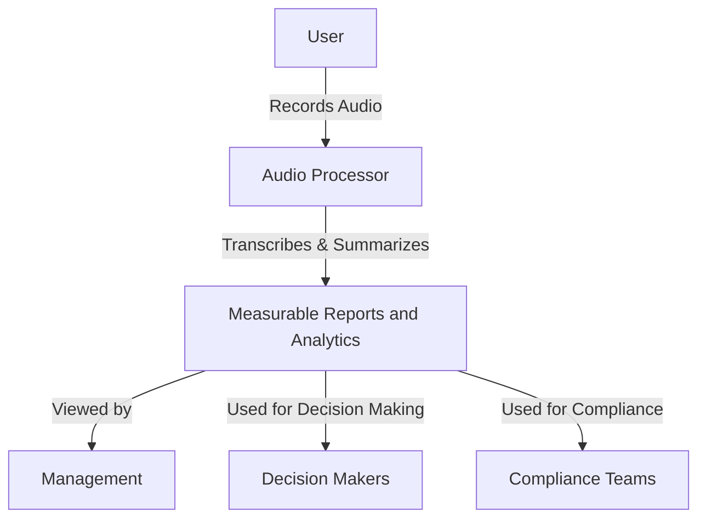
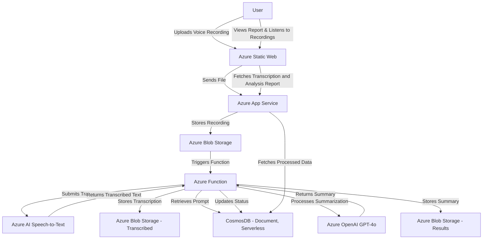
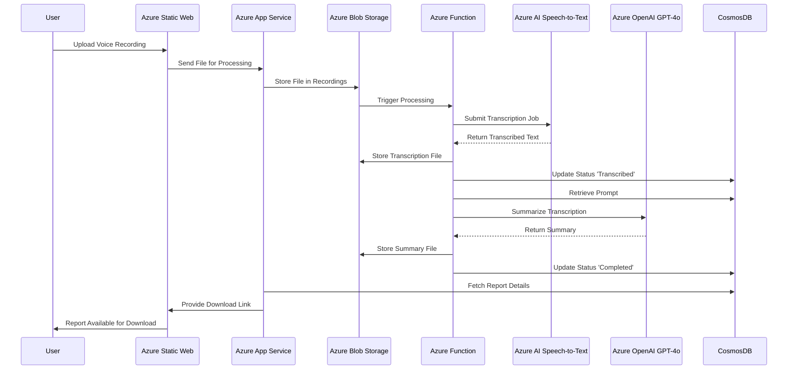

# Sonic Brief Project

> [!IMPORTANT]
> **🚀 SRS Edition Available**: This repository includes an enhanced **SRS Edition** with enterprise features including Microsoft Entra ID authentication, browser-based audio recording, advanced analytics, and comprehensive auditing.
>
> **For MVP deployment with enterprise features**, see the [SRS Edition Overview](./SRS-Edition-Overview.md) and complete [SRS Documentation](./SRS%20Docs/) for enhanced capabilities and organizational review guidance.
>
> **For base edition or manual deployment**, continue reading below.

> [!WARNING]
> **Open Source Community Project - Use At Your Own Risk**
>
> This software is provided **"AS IS"** without warranty of any kind. SRS Wales, Servent, and all contributors disclaim all liability for the use, deployment, or modification of this software. This Solutions Accelerator has been enhanced by SRS Wales and may be considered MVP, but still requires thorough review to ensure it meets your organizational standards.
>
> **You are solely responsible for:**
>
> - Security, compliance, and regulatory requirements
> - Testing in non-production environments before deployment
> - Ongoing maintenance, support, and security patching
> - All costs, risks, and consequences of deployment

## Table of Contents

1. [Overview](#overview)
   - [Project Description](#project-description)
   - [Problem Background](#problem-background)
   - [Use Cases](#use-cases)
2. [High-Level Architecture](#high-level-architecture)
3. [Architecture](#architecture)
4. [Components](#components)
5. [Workflows](#workflows)
6. [Prerequisites](#prerequisites)
7. [Technologies and Tools Used](#technologies-and-tools-used)
8. [Environment Configuration](#environment-configuration)
9. [Deployment Options](#deployment-options)
10. [SRS Enhancements](#srs-enhancements)
11. [Contributors](#contributors)

## Overview

### Project Description

Sonic Brief is a cloud-based audio processing system that allows users to efficiently process voice recordings by transcribing them into text and generating summarized reports. It provides an end-to-end workflow from audio input to structured reports.

> **📄 Based on Azure Samples**: This project is built upon the original [Azure-Samples/sonic-brief](https://github.com/Azure-Samples/sonic-brief) repository, with significant enhancements and enterprise features added by the SRS Wales community edition.

### Problem Background
From our research, many organizations reported that their internal resources waste around **70% of their time** transcribing and summarizing their audio use cases. Some organizations stated that they cannot process all of their internal audio due to **limited capacity and high costs**. For example, call centers struggle with the operational headache and expenses of manually transcribing and summarizing conversations.

To address these pain points, this project provides an automated solution to streamline transcription, summarization, and structured report generation. It allows organizations to customize their workflows and significantly **reduce time and costs** while transforming unstructured audio inputs into structured, measurable data. It transforms unstructured voice inputs into measurable, structured outputs, improving efficiency and accessibility of voice data analysis.

### Use Cases

- **Medical Summarization for Appointments** 🏥: Transcribe and summarize doctor-patient conversations to create structured medical notes.
- **Social Workers Summarization for Appointments** 🏠: Convert case discussions into structured reports for better case tracking and management.
- **Call Center QA for Summarization and Analysis** 📞: Analyze customer support interactions, extract insights, and generate quality assurance reports.
- **Legal Documentation**  ⚖️: Transcribe legal proceedings and meetings into structured, searchable documents.
- **Academic Research and Interviews** 🎓: Automatically convert research interviews into summarized reports for easier analysis.
- **Business Meetings & Conference Calls** 💼: Generate structured summaries from meeting recordings to improve collaboration and documentation.

## High-Level Architecture
This system leverages various **Microsoft Azure** tools for processing and storage, including:

- **Azure Static Web Apps**: Provides a web interface for user interaction.
- **Azure App Service**: Handles backend logic for user management, file handling, and workflow execution.
- **Azure Blob Storage**: Stores audio recordings, transcriptions, and reports.
- **Azure Functions**: Processes voice recordings asynchronously, handling transcription and summarization tasks.
- **Azure Speech-to-Text API**: Converts audio into structured text.
- **Azure OpenAI GPT-4o**: Summarizes transcriptions and refines text output.
- **CosmosDB (Document, Serverless)**: Manages metadata, logs, and user records.
> [!Note]
> The architecture separates components and follows an asynchronous model to ensure scalability and a balanced cost structure. It ensures seamless integration between various Azure components, facilitating automated transcription, summarization, and report generation. The system leverages Microsoft Azure services, including Azure Static Web, Azure App Service, Azure Cosmos DB, Azure Functions, Blob Storage, Speech-to-Text, and OpenAI GPT-4o for summarization.
### Architecture Diagram

The system consists of multiple components working together:

1. **Azure Static Web** - This is a React app that provides a web interface where end users can upload voice recordings, view transcripts, and access reports. The UI allows the user to view the transcription and PDF analysis report by retrieving this information from the database. It allows the user to add prompts and customize the prompt for the report summarization. It also includes login and register functionality and interacts with Azure App Service as a backend.
2. **Azure App Service** - This is the backend service written using FastAPI and mainly interacts with CosmosDB, the frontend, and Azure Blob Storage to upload files, register users, login, and retrieve data from the database.
3. **Azure Blob Storage (Recordings)** - Stores uploaded voice recordings.
4. **Azure Functions** - This function is written in Python and triggers based on Azure Blob Storage triggers for every new recording upload. It runs asynchronously for each new blob recording upload. The function handles transcription, uploads transcriptions, updates the database, and summarizes the text using GPT-4o while fetching prompts from the database.
5. **Azure Speech-to-Text** - Converts voice recordings into text.
6. **Azure OpenAI GPT-4o** - Summarizes the transcribed text.
7. **Azure Blob Storage (Results)** - Stores processed transcripts and summarized reports.
8. **CosmosDB (Document, Serverless)** - Stores metadata, logs, and user activity for analytics and tracking.

## Workflow

1. **User Uploads Recording**: The end user uploads a voice recording via the **Azure Static Web** interface.

2. **File Storage & Processing Trigger**: The **Azure App Service** stores the recording in **Azure Blob Storage (Recordings)**, triggering an **Azure Function**.

3. **Azure Functions: Transcription and Summarization Processing**:

   - **Getting file from Azure Blob from the trigger**
   - **Transcription Process**:
     - The function submits the transcription job to Azure AI Speech "Speech to Text" and updates the database with the status 'transcribing'.
     - It waits and checks the transcription status until completion.
     - If successful, the transcribed text file is uploaded to Azure Blob Storage (transcribe.txt).
     - The database is updated with the status 'transcribed', and the Blob URL is stored.
   - **Prompt Retrieval & Summarization**:
     - The function retrieves the relevant prompt based on the job category and sub-category ID from the database.
     - The transcribed text is sent to **Azure OpenAI GPT-4o**, which generates a concise summary.
   - **Report Storage & Completion Update**:
     - The summarized report is stored in **Azure Blob Storage (Results)**.
     - The function updates the database with the status 'completed' and stores the analysis report file Blob URL.

4. **Report Retrieval**:

   - The **Azure App Service** retrieves the processed data from the database.
   - The UI fetches and displays the transcription and analysis report.
   - The user can listen to the recordings and view job details.
   - The user can download the final report.

5. **Logging & Analytics**: Logging and metadata are stored in **CosmosDB (Document, Serverless)** for tracking and analytics.

## Prerequisites

To deploy and run this project, you need:

- **Microsoft Azure Account** with access to the following services:
  - Azure Static Web Apps
  - Azure App Service
  - Azure Blob Storage
  - Azure Functions
  - Azure Speech-to-Text API
  - Azure OpenAI GPT-4o API
  - CosmosDB (Document, Serverless)
- **Node.js** (for frontend development, if applicable)
- **Python** (backend implementation)

## Environment Configuration

The solution relies on a small set of environment variables to tune behavior across the Backend (FastAPI), Azure Functions, and Infrastructure (Terraform). New variables introduced or formalized as part of the Lite Refactor Phase 1 are documented here.

> For the complete and always up-to-date list (including future sensitive keys planning), see [`CONFIGURATION.md`](./CONFIGURATION.md). This section is a summary only.

| Variable | Scope | Terraform Variable | Default | Example Prod Value | Purpose / Notes |
|----------|-------|--------------------|---------|--------------------|-----------------|
| `BACKEND_LOG_LEVEL` | Backend (App Service) | `backend_log_level` | `INFO` | `WARNING` | Controls structured logging verbosity for FastAPI. Accepts standard Python levels (`DEBUG`, `INFO`, `WARNING`, `ERROR`, `CRITICAL`). Use `DEBUG` only temporarily during incident diagnosis. |
| `FUNCTIONS_LOG_LEVEL` | Azure Functions | (inline in `az_functions.tf`) | `INFO` | `INFO` | Sets log level for the audio processing Functions (consumed in `config.py`). Keep at `INFO`; raise to `WARNING` to reduce noise, or `DEBUG` briefly for troubleshooting. |
| `ALLOW_ORIGINS` | Backend (CORS middleware) | `allow_origins` | (blank ⇒ localhost defaults) | `https://your-swa-app.azurestaticapps.net,https://admin.yourdomain.com` | Comma‑separated list of allowed browser origins. If blank, only local dev origins (`http://localhost:5173`, `http://localhost:3000`) are enabled. Production MUST set explicit origins—avoid wildcards (`*`). Entries are trimmed; empty segments ignored. |
| `ENABLE_DEBUG_ENDPOINTS` | Backend (protected debug routes) | (none) | `false` | `false` (usually) | Gates access to diagnostic endpoints (e.g., `/debug-audit`). Set to the string `true` only in tightly controlled environments. In production keep `false` to return 404 for those routes. |

### Setting Values

1. **Terraform (recommended for hosted envs)**: Provide `backend_log_level` / `allow_origins` in `terraform.tfvars` (see `infra/variables.tf.sample`). Terraform injects these into App Service application settings (`BACKEND_LOG_LEVEL`, `ALLOW_ORIGINS`).
2. **Azure Portal**: For ad‑hoc changes, update App Service Configuration > Application settings. Names must match exactly.
3. **Local Development**: Add to `backend_app/.env` (or create) using the same variable names. Do not commit secrets—these vars here do not hold secrets by design.

### Recommended Production Baseline
- Start with `BACKEND_LOG_LEVEL=INFO` and move to `WARNING` after stability if log volume is high.
- Always set a precise `ALLOW_ORIGINS` list that matches your Static Web App (and any approved admin host). Avoid trailing slashes.
- Leave `ENABLE_DEBUG_ENDPOINTS=false` in production. Use a staging slot if you need it enabled for investigations.
- Keep `FUNCTIONS_LOG_LEVEL=INFO`; only raise to `DEBUG` temporarily.

### Security / Hardening Notes
- No environment variable listed here should contain secrets; API keys (Speech, OpenAI) are managed separately and should move to Key Vault in future phases.
- If adding new variables, prefer explicit purpose‑driven names (`AUDIO_MAX_DURATION_SECS`) over generic (`SETTING1`). Update this table when doing so.
- Treat enabling `ENABLE_DEBUG_ENDPOINTS=true` as an operational change requiring review.

### Troubleshooting
| Symptom | Likely Cause | Resolution |
|---------|--------------|-----------|
| Browser CORS errors from production domain | `ALLOW_ORIGINS` missing or malformed | Set `ALLOW_ORIGINS` to include the exact `https://<your-swa>.azurestaticapps.net` origin; redeploy/restart. |
| Excessive log volume | Verbose level (`DEBUG`) left enabled | Revert `BACKEND_LOG_LEVEL` to `INFO` or `WARNING`; restart App Service. |
| Debug endpoints unexpectedly accessible | `ENABLE_DEBUG_ENDPOINTS` set to `true` | Reset to `false` and restart; audit access logs. |
| Functions logs too noisy / too sparse | `FUNCTIONS_LOG_LEVEL` set incorrectly | Adjust to `INFO`; avoid leaving `DEBUG` on. |

> Tip: After changing Terraform variables, run `terraform apply` (or your pipeline) to propagate updates. For portal edits, an App Service restart may be required for consistency.

## Deployment Options

Choose your deployment path based on your needs:

### 🚀 **SRS Edition (Enhanced MVP Solution)**

**Enterprise-enhanced solution requiring organizational review**

- **Automated Terraform Deployment**: Complete infrastructure as code with enterprise security
- **Microsoft Entra ID Authentication**: Enterprise SSO and role-based access
- **Advanced Features**: Browser audio recording, analytics, auditing, and mobile support
- **MVP Ready**: Comprehensive monitoring, troubleshooting guides, and operational documentation for organizational evaluation

**→ Get Started**: [SRS Edition Overview](./SRS-Edition-Overview.md) | [SRS Documentation](./SRS%20Docs/)

---

### 📚 **Base Edition Deployment** `[COMMUNITY/LEGACY]`

**Original implementation for learning, testing, or manual setup**

#### Manual Deployment `[LEGACY]`

Step-by-step deployment via Azure Portal. Suitable for:
- Learning the system architecture
- Testing and experimentation
- Custom deployment scenarios

**→ Documentation**: [Manual Deployment Guide](manual-deployment/README.md)

#### Terraform Deployment (Base)

Automated deployment of base functionality without enterprise features:

**→ Documentation**: [Terraform Deployment Guide](infra/README.md)

---

### 🤔 **Which Should You Choose?**

| Use Case | Recommended Option |
|----------|-------------------|
| **MVP deployment with enterprise features** | 🚀 **SRS Edition** |
| **Enterprise authentication needed** | 🚀 **SRS Edition** |
| **Advanced features (analytics, auditing)** | 🚀 **SRS Edition** |
| **Learning/experimenting** | 📚 **Base Edition (Manual)** |
| **Custom integration requirements** | 📚 **Base Edition (Terraform)** |
| **Legacy system maintenance** | 📚 **Base Edition** |

> **⚠️ Important**: The SRS Edition is an MVP solution that includes enterprise features but requires organizational review and potential modifications before being considered production-ready for your specific environment.

### Technologies and Tools Used

- **Frontend**: Azure Static Web Apps
- **Backend**: Azure App Service, Azure Functions
- **Storage**: Azure Blob Storage
- **AI Processing**:
  - Azure Speech-to-Text
  - Azure OpenAI GPT-4o
- **Database**: CosmosDB (Document, Serverless)
- **Development Tools**: Node.js (for frontend), Python (for backend)
---

## SRS Enhancements

Shared Resource Services Wales (SRS) has significantly enhanced the base Sonic Brief implementation, transforming it from a proof-of-concept into an MVP solution with enterprise features. These improvements focus on user experience, security, operational capabilities, and administrative functionality.

### Key Enhancement Areas

The SRS Edition includes enterprise-grade enhancements across multiple areas:

- **🔐 Authentication**: Microsoft Entra ID integration with SSO and conditional access
- **🎙️ Audio Input**: Browser recording capabilities with format auto-conversion  
- **⚡ Processing Options**: Flexible transcription workflows for cost optimization
- **📊 Analytics & Reporting**: Usage dashboards, cost tracking, and performance metrics
- **🔍 Auditing**: Comprehensive audit trails with searchable compliance interface
- **🎨 User Experience**: Modern responsive design with improved navigation
- **🔧 Administration**: User management, system configuration, and data retention policies
- **🛡️ Security**: Enhanced data protection and secure token handling
- **📱 Mobile Access**: Optional Android/iOS app with offline recording capabilities

> **📋 Complete Details**: Visit the [SRS Edition Overview](./SRS-Edition-Overview.md) for comprehensive feature descriptions, deployment configuration, and organizational considerations.

### �📌 **Contributors**

We appreciate the efforts and contributions of the following individuals:

#### Original Development Team
| Name                 | LinkedIn |
|----------------------|-----------------|
| **Moustafa Mahmoud** | [MoustafaAMahmoud](https://www.linkedin.com/in/moustafaamahmoud/)   |
| **Wolfgang Knupp**   | [WolfgangKnupp](https://www.linkedin.com/in/wolfgangknupp/)               |

#### SRS Wales Enhancement Team
| Name                 | Organization | Role |
|----------------------|-------------|------|
| **Simon Harris**     | Shared Resource Services Wales | Lead Developer & Architecture |
| **Bonny Ramsay**     | Shared Resource Services Wales | Developer,Tester & Operational Support |
| **Katie Rees**     | Shared Resource Services Wales | Solution Advisor & Tester |
| **Matt Lewis**     | Shared Resource Services Wales | COO, AI Solution Champion (no 32 in top 100 AI Digital Leaders 2025 - https://awards.digileaders.com/AI100List ) |

#### Servent Mobile Frontend Team
| Name                 | Organization | Role |
|----------------------|-------------|------|
| **Stuart Stephenson**     | Servent | Lead Developer & Architecture |
| **Declan Gildea**     | Servent | Programme Management |

### Special Thanks

> [!Note]
> **Microsoft Support Team**: Special thanks to Rob Hutchings, Martyn Johnson, and Drew Thomas from Microsoft for their invaluable guidance and support during the SRS version development.
>
> **Leicestershire County Council**: Special thanks to Chris Masuda, David Willis, and Joe Broughton for preparing the comprehensive manual deployment guidance for base version.
>
> **Very Special Thanks** to the late Tony Ellis from Buckinghamshire County Council, who's vision and support made all this possible (https://www.linkedin.com/in/tony-ellis-0635b912/?originalSubdomain=uk).
>
> **Community**: Thanks to all community contributors who have provided feedback, testing, and suggestions to enhance the solution.

If you’ve contributed, feel free to submit a PR! 🚀

